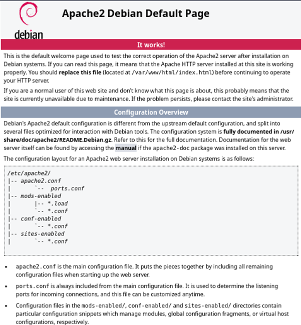

# Apache2  

## 1. What is Apache2 Web Server?
Apache2 is one of the most widely used open-source web servers in the world. It is a modular HTTP-server that sits between the browser and the website’s content, handling requests and delivering web pages.

## 2. Apache2 - Installation

```sudo apt-get install apache2```  

Check status:  
 - ```sudo systemctl status apache2```
 - (if shell does not complete ```systemctl``` install the following package: ```sudo apt-get install bash-completion```)  

Check that Apache2 is starting automatically when Debian host boots:  
 - ```sudo systemctl is-enabled apache2```
 - if not, it can be enabled like this: ```sudo systemctl enable --now apache2```  

Open browser and try to open the Apache2 Debian Default page:  
```http://localhost```  (at this point HTTPS does not work)

  


## 3. Apache2 configuration  

```
/etc/apache2/
|--apache2.conf  
|            --ports.conf
|
|--mods-available
|--mods-enabled
|
|--sites-available
|--sites-enabled
|
```
 - ```apache2.conf``` is the main configuraton file, list of ports it listens are included from ports.conf  
 - ```mods-available, mods-enabled``` are directories for different Apache modules (e.g. mod_ssl that enables HTTPS by adding support for SSL/TLS). Apache modules are plug-ins that extend the functionality of the Apache HTTP Server.  
 - ```sites-available, sites-enabled``` are directories used to manage virtual hosts (different websites served from the same server).  
   - sites-available contains a configuration file for each virtual host (active or not). Configurations are made here.  
   - sites-enabled contains symlinks (shortcuts) to the configuration files in sites-available directory. These are currently active virtual hosts.
     - to enable a site (virtual host): ```sudo a2ensite site1.conf```and ```sudo systemctl reload apache2``` (reloads Apache configuration files without restarting the service)  
     - to disable a site (virtual host): ```sudo a2dissite site1.conf```and ```sudo systemctl reload apache2```

__Default web page:__ ```/var/www/html/index.html```   
 - is shown when someone visits the site.
 - ```index.html``` can be edited in order to customize the homepage.  

Do the following tests:  
 - Change the content of ```index.html``` and reload the page - what do you see?  
 - ```tail -f /var/log/apache2/access.log``` and reload the page. What do you see in the log?
   
   Do you see anything in  ```tail -f /var/log/apache2/error.log```?  
 - open another terminal and type ```curl localhost```. What do you see in the log?


__Default virtual host configuration:__    
```/etc/apache2/sites-available/000-default.conf```  

__Least privilege principle:__ 
 - when creating apache2 configuration ```sudo``` is used only when absolutely necessary  
 - in this exercise the configuration changes will be done to files in directories  ```*-available``` and ```*-enabled```. There is no need to modify e.g. apache.conf, or ports.conf  
 - home pages will be created in user's home directory as __a regular user__ -  ```sudo``` should __not__ be used  

## 4. Install ufw (uncomplicated firewall)  
Apache2 web server accepts incoming http/https requests from Internet on public-facing IP addresses. Therefore firewall is needed to restrict and manage incoming traffic and protect the server from unauthorized access and potential attacks.  

```sudo apt-get install ufw```  

```sudo ufw allow ssh```  or ```sudo ufw allow 22/tcp``` (Always allow SSH before enabling ufw if you're connected remotely, or you might lock yourself out)  

```sudo ufw enable```  

Allow ports http(80) and https(443) ports:    
```
sudo ufw allow 80/tcp  
sudo ufw allow 443/tcp  
```
verify that rules are active:  
```sudo ufw status verbose```  

you should see the following ports allowed: 
```
To                         Action      From    
22/tcp                     ALLOW       Anywhere  
443/tcp                    ALLOW       Anywhere  
80/tcp                     ALLOW       Anywhere  
```
 
## 5. name-based virtual hosts
A name-based virtual host makes it possible to run multiple websites (e.g. ```site1.com``` and ```site2.com```) on a single server and IP-address. DNS resolves all sites to the same IP address. If real DNS is not available ```/etc/hosts``` can be used to map hostnames to IP addresses in __a testing environment__. In production environments a real DNS is required.  

Example ```/etc/hosts``` for testing purposes:  
```
127.0.0.1    site1.com
127.0.0.1    www.site1.com
127.0.0.1    site2.com
127.0.0.1    www.site2.com
```  

__Example__ - create a new virtual host ```site1.com```.   
The required steps are the following:  
 1. Create the configuration file: ```sudoedit /etc/apache2/sites-available/site1.com.conf```. The configuration file should include at minimun the following:  
    ```
    <VirtualHost *:80>  
      ServerName site1.com  
      ServerAlias www.site1.com  
      DocumentRoot /home/testuser/public-sites/  

      <Directory /home/testuser/public-sites/>  
          Require all granted  
      </Directory>  

      Errorlog ${APACHE_LOG_DIR}/error-site1.log  
      Customlog ${APACHE_LOG_DIR}/access-site1.log combined  
      
    </VirtualHost>  
    ```
    
 2. Create document root to your home directory: ```sudo mkdir -p /home/testuser/public-sites/```.
    The content of the website will be created into ```index.html``` located in this directory. Create some content there.
    
 3. Set permissions:  
    Apache is running as a user  ```www-data```. To be able to read the file Apache must be able to access the directories (x) and read the file (r)

    ```chmod o+r /home/testuser/public-sites/index.html```
    
    ```chmod o+rx /home/testuser/public-sites```
    
    ```chmod o+x /home/testuser```
    
    ```chmod o+x /home```  

 5. Enable the site ```sudo a2ensite site1.com.conf```  
 6. reload Apache2: ```sudo systemctl reload apache2```

Test your new site:  
  - open browser: ```http://site1.com```  
  - ```curl site1.com```  

## References  
https://terokarvinen.com/2018/04/10/name-based-virtual-hosts-on-apache-multiple-websites-to-single-ip-address/  
