# How to Install Linux to Virtualbox?
In this example the following components are in use
- host operating system: Windows 11
- Virtualization software: Virtualbox (7.x)
- Guest operating system: Debian 13.0.0 (Trixie)

## 1. Virtualbox installation  
Pre-requisite:    
- __VT-X__ must be enabled in the host machine __UEFI/BIOS__.  
- VT-x (Intel virtualization technology) provides hardware support for virtualization, making it more efficient than software-based solutions.
- It's often disabled by default in the UEFI/BIOS settings. To enable it, you'll need to access your computer's BIOS settings during startup by pressing a specific key (could be F10, F12, ESC, etc. - check your HW manual)  

Virtualbox installer for windows hosts is available here: https://www.virtualbox.org/wiki/Downloads    
Virtualbox documentation: https://www.virtualbox.org/manual/    

## 2. How to Download Debian ISO image?
In this example __debian-live-13.0.0-amd64-xfce.iso__ will be used. It can be downloaded from here: https://cdimage.debian.org/debian-cd/13.0.0-live/amd64/iso-hybrid/   

What is an ISO image?   
     - a 'Digital replica of the disk'  
	 - a single file that contains a complete copy of the data from an optical disc, like a CD or DVD, including the file system and all the files and folders.  
     - ISO image is mountable which means it can be made visible to the operating system by attaching it to a specific location in the file system.  


## 3. How to create a new virtual machine to Virtualbox?

1) Open Virtualbox and click __new__.

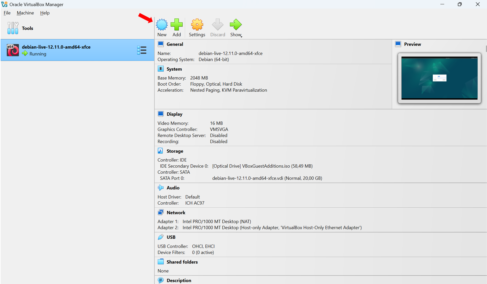  

2) Give needed input and check that all values are correct:
  - name
  - ISO image (path to location where the image is downloaded)
  - type: linux
  - subtype: debian
  - version: debian (__64__-bit)
  - Skip unattended installation

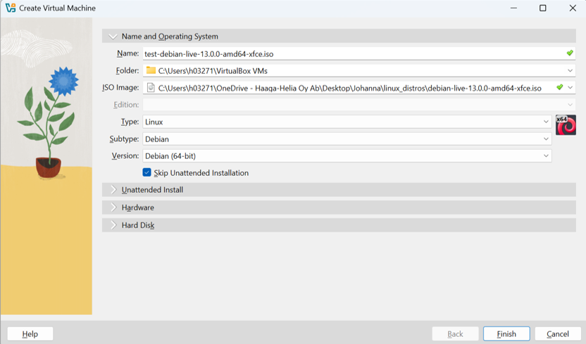 
 
3) RAM Memory and CPUs
- minimun 2048MB RAM, recommended 4096MB
- for example 2 CPUs
- Enable EFI  

What is (U)EFI:
       - Unified Extensible Firmware Interface  
       - firmware in non-volatile memory which starts first when computer is powered on  
	   - loads bootloader (e.g.GRUB) which in turn loads linux kernel and starts OS  
	   - has advanced features that are not available in BIOS such as secure boot 
	   - secure boot ensures that only trusted, signed software can run when your computer starts.  

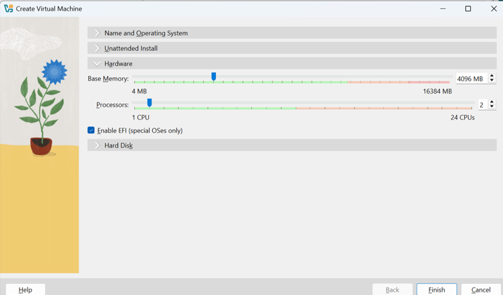 
  
4) Hard Disk size
- minimun 20GB, recommended ~50GB

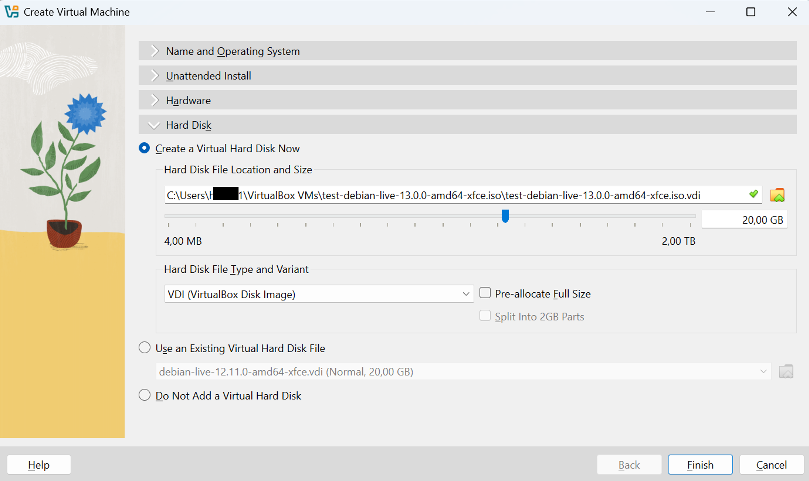 

## 4. How to install Debian to the VM?

1) __Start the VM you just created__

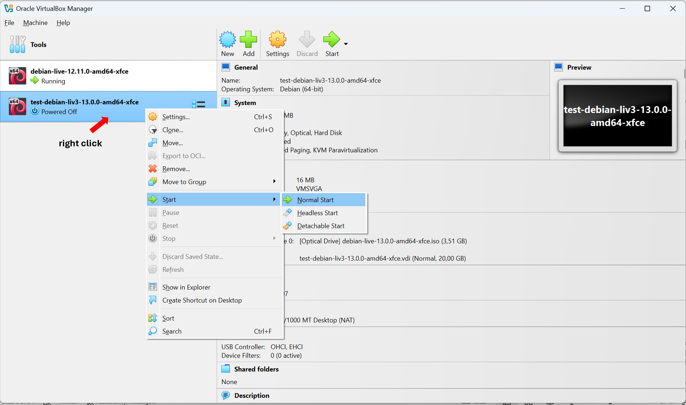 

2) __Live Install__  
Let's test first with live install. With this it is possible to boot a fully functional Debian system without installing anything.
This is useful for testing hardware compatibility or exploring the desktop environment. Select the first option from the list and press enter.

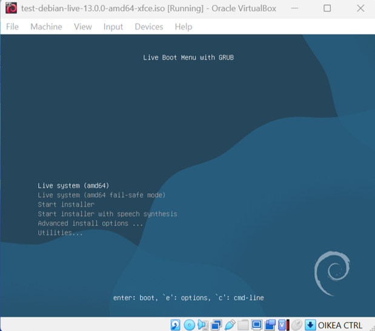 

Some tests:  
- start web browser (from applications menu in top left corner) and check that Internet connectivity works e.g. check the weather forecast  
- open terminal (icon in the bottom) and type some commands to check that keyboard is working e.g. pwd (current directory), whoami (my username), date etc.
- how about ls -la (list files in the directory)?

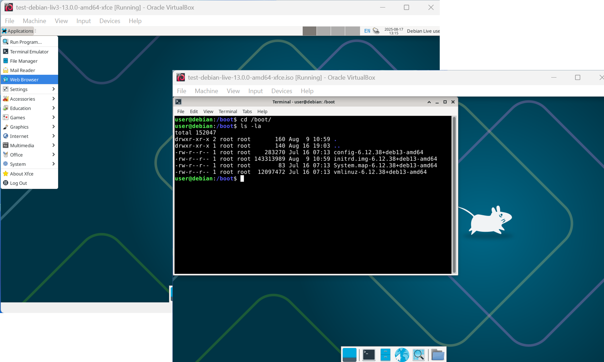 

3) __Real Installation__  
First the VM need to be rebooted in order get back to __Live Boot Menu with GRUB__:
- option1: in the terminal type: __reboot__
- option2: in the top right corner click __debian live user__ and __shutdown__. Start the VM from virtual box as explained above.  

From the Live Boot Menu use arrow keys to scroll down and select __start installer__.  
Before the actual installation starts a set of input parameters need to be given. These are listed here (a-o):  

a) select language: __English__  
b) select your location: __Helsinki__ (time zone)  
c) configure locales: __en-US.UTF-8__ (character encodings, how to represent text in computers)  
d) configure the keyboard: __finnish__  

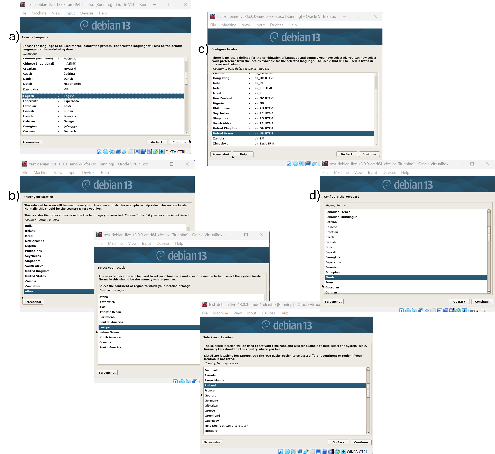 

e) configure the network - hostname: linux-test  
f) configure the network - domain: example.com  

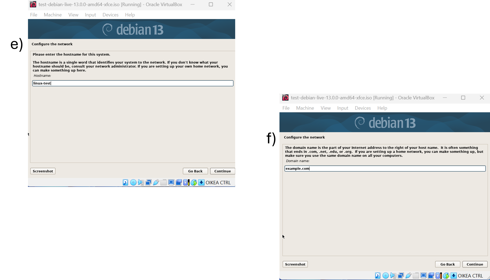
  
g) setup users and passwords - root password will __not__ be configured, this will be __left empty__  
h) setup users and passwords - full name of the new user: your name (first_name, Last_name)  
i) setup users and passwords - username of your account: your first name  
j) setup users and passwords - choose a password for the new user: __use strong password here__  

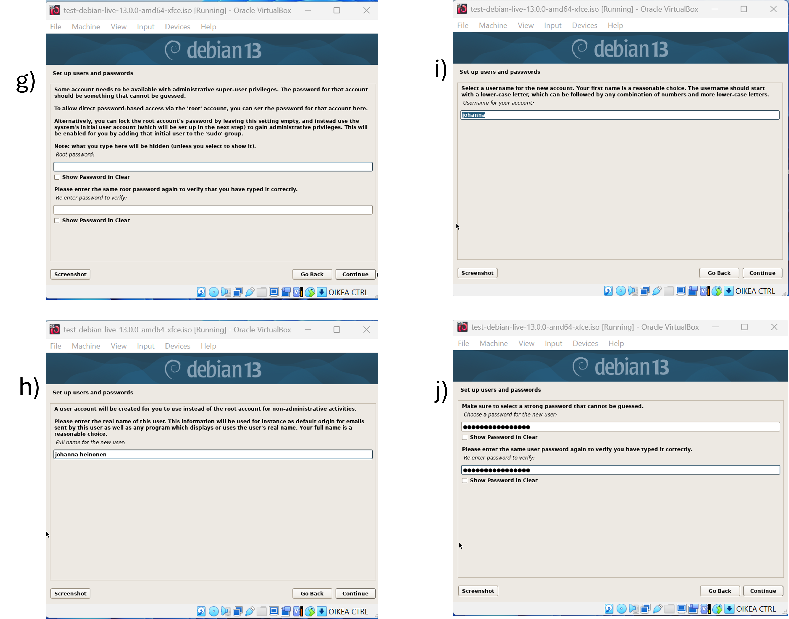
  
k) partition disks - partitioning method: __guided - use entire disk__  
l) partition disks - select disk to partition: select the virtual disk you created for your VM (probably the only option available)  
m) partition disks - partitioning scheme: All files in one partition (recommended for new users)  
n) partition disks - finish partitioning and write changes to disk  

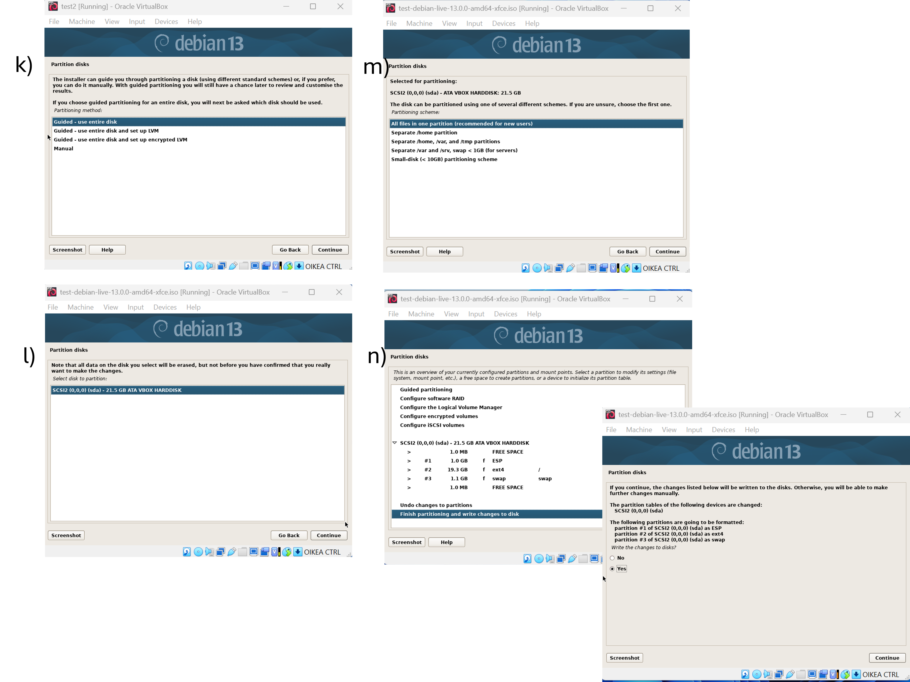

o) installation complete - please choose continue to reboot  

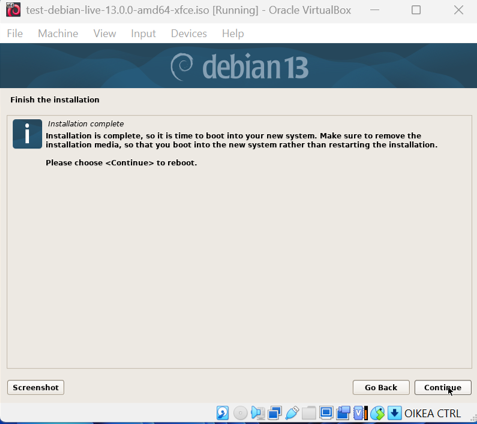

## 5. Populating sources.list  
'apt-get update' refreshes the system's knowledge of available packages.
After installing debian13 (trixie) from ISO image the only entry in /etc/apt/sources.list is  

`deb cdrom: [Debian GNU/Linux Live 13.0.0 xfce 2025-08-... ]/ trixie main`   

This entry points to the installation media (ISO image) that is no longer mounted. As a consequence 'apt-get update' fails because it has no access to online repositories. In order to fix this issue the /etc/apt/sources.list file must be updated.  
https://wiki.debian.org/SourcesList#sources.list contains an example (from debian12, bookworm) that can be used - just every word __bookworm__ need to be replaced by the word __trixie__  


```
deb https://deb.debian.org/debian trixie main non-free-firmware
deb-src https://deb.debian.org/debian trixie main non-free-firmware

deb https://security.debian.org/debian-security trixie-security main non-free-firmware
deb-src https://security.debian.org/debian-security trixie-security main non-free-firmware

deb https://deb.debian.org/debian trixie-updates main non-free-firmware
deb-src https://deb.debian.org/debian trixie-updates main non-free-firmware


test

