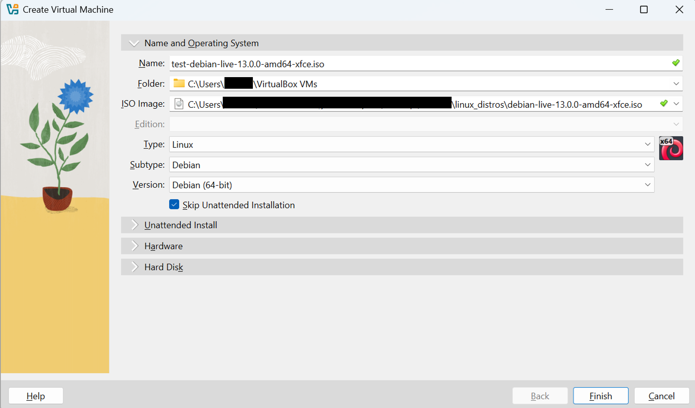

# How to Install Linux to Virtualbox?
In this example the following components are in use
- host operating system: Windows 11
- Virtualization software: Virtualbox (7.x)
- Guest operating system: Debian 13.0.0 (Trixie)

## Virtualbox installation
Virtualbox installer for windows hosts is available here: https://www.virtualbox.org/wiki/Downloads    
Virtualbox documentation: https://www.virtualbox.org/manual/    

## How to Download Debian ISO image?
In this example __debian-live-13.0.0-amd64-xfce.iso__ will be used. It can be downloaded here: https://cdimage.debian.org/debian-cd/13.0.0-live/amd64/iso-hybrid/  

## How to Install new virtual machine to Virtualbox?

1) Open Virtualbox and click __new__.

  

2) Give needed input and check that all values are correct:
  - name
  - ISO image
  - type: linux
  - subtype: debian
  - version: debian (__64__-bit)
  - Skip unattended installation

 
 
3) RAM Memory and CPUs
- minimun 2048MB RAM, recommended 4096MB
- for example 2 CPUs
- Enable EFI:
       - (U)EFI (Unified Extensible Firmware Interface)
       - firmware in non-volatile memory which starts first when computer is powered on and loads bootloader (e.g.GRUB) which in turn loads linux kernel and starts OS

 
  
