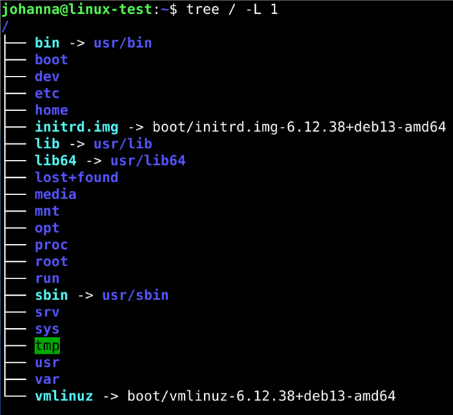

# Linux Commands
Linux has many commands with many parameters. How to get help with these?
- command line flags: `<command>` --help   
 for example  ```cd --help``` or ```grep --help```  
- manual pages exist for most commands: man `<command>`
- Google, AI

Autocompletion:  
- Tab (above caps lock) twice shows what commands are available next. Tab also fills commands if it is unambiguous.  
- For example:  
 	```
  	ls /etc/h[tab][tab]   
    hdparm.conf	host.conf	hostname	hosts	hosts.allow	hosts.deny  
  	```
   - arrow up / arrow down keys show command history.  
   - ```history``` lists the command line history. CTRL-R can be used to search from history.

## 1. Linux Package Management (Debian based distributions)
Linux package management installs, updates, configures and removes software on a linux. To do this root privileges are required as installing or removing software affects the system as a whole.  

```sudo``` gives root privileges to a single command. It first checks if user is allowed to run privileged commands and then temporarily elevates permissions for that command (password asked).  


### Tools
```sudo apt-get update``` (updates the package list, does not install or upgrade anything)  
```sudo apt-get install <package>```  
```apt-cache search <package>```  
  - example:  
    ```apt-cache search tree```  
    ```apt-cache search tree | grep ^tree```  
      - grep searches for patterns in text  
      - ^ matches the begining of line 
      - grep ^tree matches any line where "tree" is the first word  
      - | takes output from one command and feeds it as input into another (| is called pipe)  

```apt-cache show <package>```    


## 2. Linux Filesystem 
Filesystem Hierarchy Standard (FHS) defines a standard layout for directories and their intended contents in Linux. Therefore the directory stucture is similar independent of the LInux distribution. The root directory __/__ is the top-level of the entire filesystem tree, everything else branches out from it.  

In Linux 'everyting is treated as a file' which means that almost every resource (a document, a directory, a hardware device, or even a running process) is accessed and manipulated as if it were a file. Thus it is possible to use the same tools across many types of resources.  

```tree / -L 1```  

  


Some directories:
- /bin is the directory that contains binaries, for example ls, pwd, mkdir etc.  
- /boot directory contains files required for starting your system (do not touch)  
- /dev contains device files  
- __/etc__ contains system-wide configuration files. For example, the name of the system is in ```/etc/hosts```  
- __/home/testuser__, home directory of user 'testuser'. Directory /home/ contains home directories for all users. Users can store permanently data to their home directory.   
- /lib directory for libraries   
- __/media__ is directory where external storage will be automatically mounted when you plug it in, for example /media/cdrom  
- /mnt directory is where you can manually mount storage devices or partitions  
- /opt directory is for software that is not managed by system's package manager, for example software you build from source code   
- /proc contains information about your computer, for example ´´´/proc/cpuinfo´´´ shows CPU model, number of cores etc.
- /root is the home directory of the superuser  
- /sbin is similar to /bin, but it contains applications that only the superuser will need  
- __/var__ contains things like logs in the /var/log subdirectories. Logs are files that register events that happen on the system  
  
  

## 3. Navigating the Linux Filesystem
### pwd 
Identifies current location, prints the name of the __current working directory__.  
### ls 
Lists directory contents   
- ```ls``` (content of the current working directory)
- ```ls -l```  
- ```ls -a```    
- ```ls -la```  
- ```ls /```
- __.__ current directory
- __..__ parent directory  
Every directory, no matter how empty, includes these two entries so the system can always reference its location and parent.
- __~__ refers to home directory  
     
### cd 
Change working directory
- ```cd /etc``` (is the same as cd /etc/ )  
- ```cd``` (go to home directory)
- ```cd ..``` (go to parent directory, move one level up in the directory tree)
- ```cd``` (straight to home directory)
- ```cd /``` (go to root directory)

### Absolute and Relative Path
Absolute path starts from the root __/__ directory. Relative path is based on current working directory (check with ```pwd```). 
Example: Create a new directory under user's home directory:
- absolute path: ```mkdir /home/testuser/testdir1``` or ```mkdir ~/testdir1``` creates a new directory ```testdir1``` to ```/home/testuser/``` independent of the current working directory.
- relative path: ```mkdir testdir2``` creates a new directory ```testdir2``` to the current working directory.
	- Notice: Normal user can create content only to its own home directory (```/home/testuser/```)     

## 4. more or less?
```more``` and ```less``` are both used to view (long) text files or command output one screen at a time. ```more``` displays text page by page but only forward, ```less``` is more powerful allowing also backward navigation and search. (It can be said that less is more).    

Basic navigation (```more```):  
- __Space__ forward one page
- __Enter__ down one line
- __q__ quit
  
Basic navigation (```less```):    
- __Space__ forward one page  
- __b__ backward one page  
- __arrow up/arrow down__ up/down one line  
- __/error__ forward search for word 'error'
- __?error__ backward search for word 'error'
- __q__ quit  

Examples:
- view large files: ```less /usr/share/common-licences/GPL-3```
- pipe command output: ```apt-cache search tree |less```

 

  
## 5. Editors
Editors in Linux are used to create and modity text files like writing scripts, editing configuration files etc. Some common editors:
- __nano__
- older ones: vi, emacs, pico  
- __micro__ (homework exercise)
- vscode - for software development (multi-language support, built-in git, GitHub copilot integration)

  

- open nano: ```nano test.txt```  
- exit nano:  
	- CTRL-X (is the same as ^X)  
 	- save changes: Y <enter>  


- file ```test.txt``` is created if it does not exist  
- Linux is case sensitive: ```test.txt``` is different file than ```Test.txt```    
- Linux does not rely on extensions. Unlike Windows, Linux does not use extensions like .txt, jpg, etc. to decide how to handle a file. Linux determines it by examining its contents. However, extensions have meaning for people.  
- Security consideration: when there is a need to edit a file that requires superuser (root) privileges, it is possible to do it with  
	- ```sudo nano <file>``` - In this case editor (nano) runs as a root user  
   	- ```sudoedit  <file>``` - In this case editor runs as a regular user, sudoedit makes a temporary copy of a file and when this file is saved and closed root privileges 	are used only to copy the file to its original location. The editor used is the default text editor (in debian this is typically nano).    
  

## 6. File Manipulation  
### touch
creates an empty file(s).  
Example:  
```touch file1.txt file2.txt```  

### mkdir  
```mkdir``` creates a new directory.  
examples:  
	- ```mkdir ~/testdir1``` (This directory will be created under user home directory)  
 	- ```mkdir testdir2``` (This directory will be created under the directory where the user is located, if not the home directory administrator privileges needed.)  
  	- ```mkdir testdir3 testdir4``` (creates multiple directories)  
    - ```mkdir -p testdir5/subdir/subsubdir``` (creates nested directories, -p creates parent directories if they do not exist)  
	
### cp  
```cp``` copies file(s) or directories from `[source`] to `[destination`]  
examples:  
	- copy a file to another file: ```cp test.txt test-renamed.txt``` (if test-renamed.txt does not exist, it will be created. Otherwise it will be overwritten)  
 	- copy file to another directory: ```cp test-renamed.txt ~/testdir1```    
  	- copy multiple files to another directory: ```cp *.txt ~/testdir2/```  
   	- copy entire folder and its contents to archive folder: ```cp -r ~/testdir1/ ~/archive/ ``` (if directory does not exist it will be created)  

### mv 
```mv``` is used to move or rename files: mv oldname newname  
Examples:  
	- rename a file: ```mv old.txt new.txt``` (notice: if filename new.txt is existing it will be overwritten without warnings)  
 	- move a file to another directory: ```mv test1.txt testdir1/```  
    
### rm  
Deletes files or directories from the filesystem. Once removed files are not recoverable - ```rm``` is the delete button without undo.  
Practice environment:  
```
mkdir ~/rmtest
cd ~/rmtest
touch file1.txt file2.txt file3.txt
mkdir folder1 folder2
```
Examples:  
	- remove a file: ```rm file1.txt```  
 	- remove multiple files: ```rm file2.txt file3.txt``` (or use wildcards ```rm *.txt```)  
  	- interactive deletion: ```rm -i file2.txt```  
   	- recursive deletion deletes folder and all its contents: ```rm -r folder1/```  

### rmdir
rmdir removes empty directories.  
Practice environment:  
```
mkdir -p testdir/empty testdir/full  
touch testdir/full/file.txt  
```
examples:
	- ```rmdir testdir/empty``` (deletes directory empty that is located under testdir)  
 	- ```rmdir testdir/full``` (fails to delete directory full because it is not empty - to delete directories that are not empty see the rm -r example)    


### ln -s 
ln -s `[target`] `[link_name`]  creates a symbolic link ('shortcut') between files and directories.  
	- target: the original file or directory  	
 	- link_name: the name of the symbolic link  
Practice environment:  
```
mkdir ~/original  
touch ~/original/file.txt  
```
Examples:  
	- create a symbolic link for ```file.txt``` so that it can be accessed from user's home directory: ```ln -s ~/original/file.txt ~/linkedfile.txt```    
 	- add some text to ```linkedfile.txt``` and check the content of ```file.txt```  
  	- delete ```file.txt``` and check ```linkedfile.txt```  

### chmod
```chmod``` modifies file or directory permissions. Linux permissions are split into three categories:  
	- user(u) - the owner of the file  
	- group(g) - users in the same group  
  	- others(o) - everyone else  
each group can have read(r), write(w) or execute(x) rights. 
```ls -l``` shows the file and directory permissions: the first character specifies directory(d) or file(-). User, group and others permissions (rwx) are specified after that. For example below ```file1.txt``` is a file (-) and each category (user, group, others) has read and write (rw) permissions.  
```
drwxrwxr-x 2 	testuser testuser 	4096 Aug 25 11:12 .
drwx------ 16 	testuser testuser 	4096 Aug 25 11:12 ..
-rw-rw-r-- 2 	testuser testuser 	   0 Aug 25 11:12 file1.txt
-rw-rw-r-- 2 	testuser testuser 	  13 Aug 25 11:12 script1.sh

```
```chmod``` can be used in two ways: symbolic or numeric mode. 
Examples - symbolic mode:  
	- file ```script.sh``` - add execute permissions to the user: ```chmod u+x script.sh``` 
	- file ```script.sh``` - remove excute permissions from the user: ```chmod u-x script.sh```  

 Examples - numeric mode:  

|              |      rwx     |       		    |	
|--------------|--------------|-----------------|
|      0       | 0 0 0  	  | no access   	|				
|      1       | 0 0 1        | execute(x)    	|				
|      2       | 0 1 0    	  | write(w)    	|				
|      3       | 0 1 1        | write(w)+exec(x)|				
|      4       | 1 0 0    	  | read(r)    		|				
|      5       | 1 0 1        | read(r)+exec(x) |				
|      6       | 1 1 0    	  | read(r)+write(w)|				
|      7       | 1 1 1        | full_access(rwx)|				
  
 	- file ```script.sh``` - add excutive permissions to the user: ```chmod 766 script.sh```  
  		- user: rwx  	7
		- group: rw-	6 (no changes)
  		- others rw-	6 (no changes)
  	 - file ```script.sh``` - remove excute permissions from the user: ```chmod 666 script.sh```  

	
### 7. Other useful commands
	- clear  
 	- echo  
  	- redirection: echo hello > file.txt or echo world >> file.txt  
   		- arrow (>) redirects output of a program or a command to a file. If the file exists the content will be overwritten. Otherwise the file is created.  
		- double arrow (>>) adds to an existing file or creates a new one  


