# How to Install Linux to Virtualbox?
In this example the following components are in use
- host operating system: Windows 11
- Virtualization software: Virtualbox (7.x)
- Guest operating system: Debian 13.3.0 (Trixie)

## 1. Virtualbox installation  
Pre-requisite:    
- __VT-X__ must be enabled in the host machine __UEFI/BIOS__.  
- VT-x (Intel virtualization technology) provides hardware support for virtualization, making it more efficient than software-based solutions.
- It's often disabled by default in the UEFI/BIOS settings. To enable it, you'll need to access your computer's BIOS settings during startup by pressing a specific key (could be F10, F12, ESC, etc. - check your HW manual)  

Virtualbox installer for windows hosts is available here: https://www.virtualbox.org/wiki/Downloads    
Virtualbox documentation: https://www.virtualbox.org/manual/    

## 2. How to Download Debian ISO image?
In this example __debian-live-13.3.0-amd64-xfce.iso__ will be used. It can be downloaded from here: https://cdimage.debian.org/debian-cd/13.3.0-live/amd64/iso-hybrid/ (scroll down the page and find __debian-live-13.3.0-amd64-xfce.iso__ from the list).

What is an ISO image?   
     - a 'Digital replica of the disk'  
	 - a single file that contains a complete copy of the data from an optical disc, like a CD or DVD, including the file system and all the files and folders.  
     - ISO image is mountable which means it can be made visible to the operating system by attaching it to a specific location in the file system.  

What is a Linux distribution?
- Linux is a Unix-like, open source community developed operating system.
- Linux kernel is the 'engine of the car', kind of bridge between hardware and software: it handles tasks such as memory management, process management, device drivers, system calls etc.
- Linux distributions add more functionality on top of kernel including  
		- a packet manager that is used to install and update software  
  		- desktop environments: GNOME, KDE, xfce etc.  
  		- applications such as browsers, development tools, etc.  
  		- GNU core utilities (coreutils) - ls, grep, cp, rm, mkdir... (https://www.gnu.org/software/coreutils/)  
- 'Distro' is a customized version of linux possibly tailored to specific needs and user preferences. Examples:  
  		- Debian (community driven) / Ubuntu (Canonical)  
  		- RedHat / Fedora (RH's upstream, community driven development platform for RHEL)  
  		- SUSE  
  		- Arch (https://wiki.archlinux.org/title/Main_page)  

## 3. How to create a new virtual machine to Virtualbox?

0) If your new Virtualbox installation asks which mode to use select __expert mode__.
1) Open Virtualbox and click __new__.

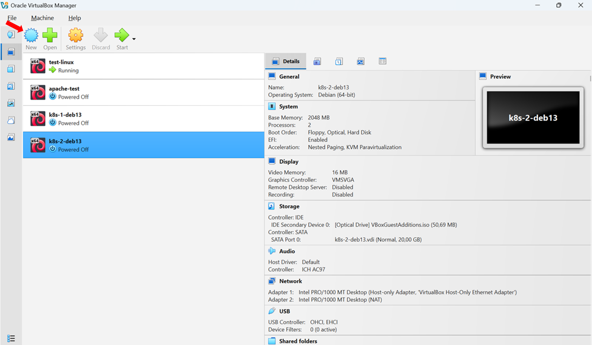  

2) Give needed input and check that all values are correct:
  - VM name
  - ISO image (path to location where the image is downloaded)
  - type: linux
  - subtype: debian
  - version: debian (__64__-bit)
  - Make sure the box ‘Proceed with Unattended Installation’ is not checked.  
		- notice that in some earlier versions the default was the opposite.

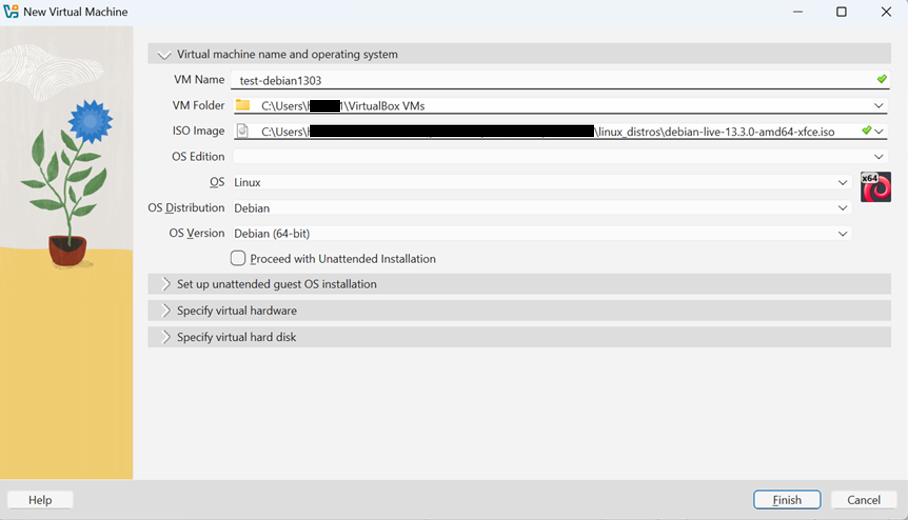 
 
3) RAM Memory and CPUs
- minimun 2048MB RAM, recommended 4096MB
- for example 2 CPUs
- Use EFI  

What is (U)EFI:
       - Unified Extensible Firmware Interface  
       - firmware in non-volatile memory which starts first when computer is powered on  
	   - loads bootloader (e.g.GRUB) which in turn loads linux kernel and starts OS  
	   - has advanced features that are not available in BIOS such as secure boot 
	   - secure boot ensures that only trusted, signed software can run when your computer starts.  

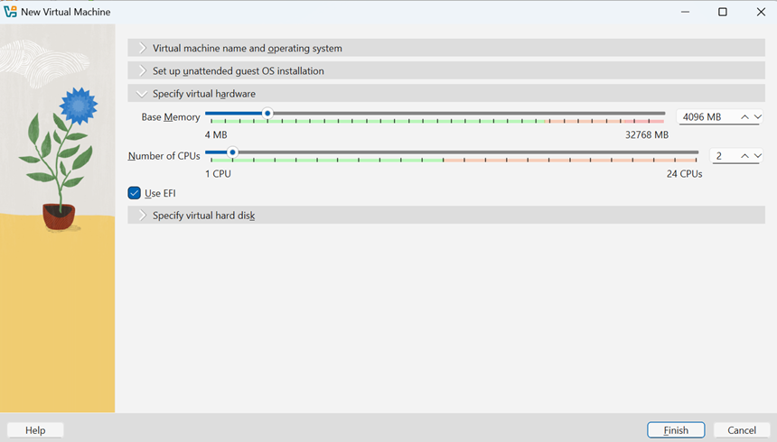 
  
4) Hard Disk size
- minimun 20GB, recommended 20-40GB  
- Click __Finish__ to complete the creation of a new virtual machine.

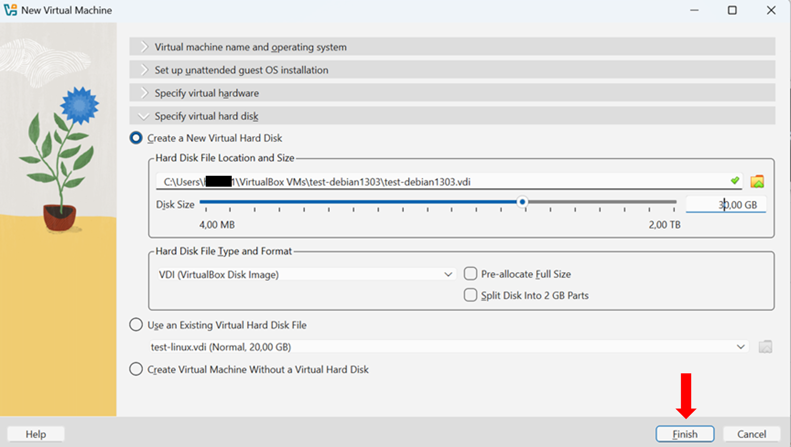 

## 4. How to install Debian to the VM?

1) __Start the VM you just created__

Start the VM by right‑clicking its name, or simply double‑click the VM to launch it.

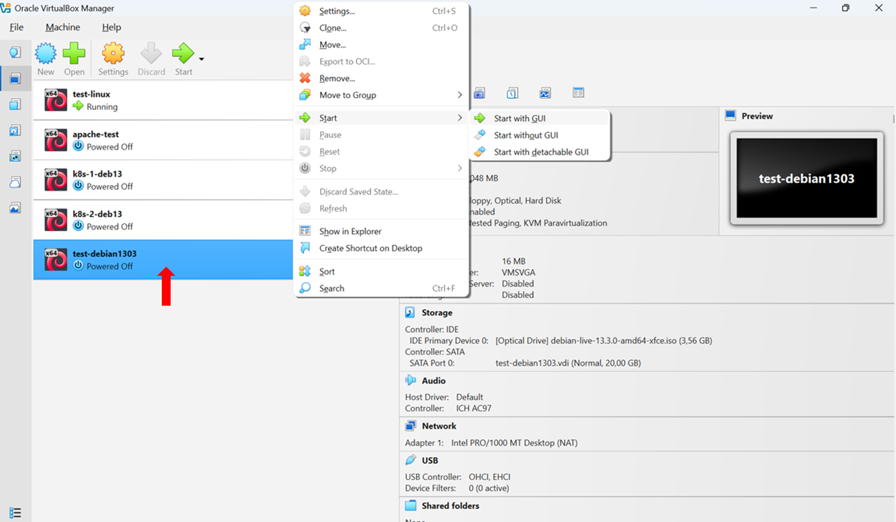 

2) __Live Install__  
Let's test first with live install. With this it is possible to boot a fully functional Debian system without installing anything.
This is useful for testing hardware compatibility or exploring the desktop environment. Select the first option from the list and press enter.

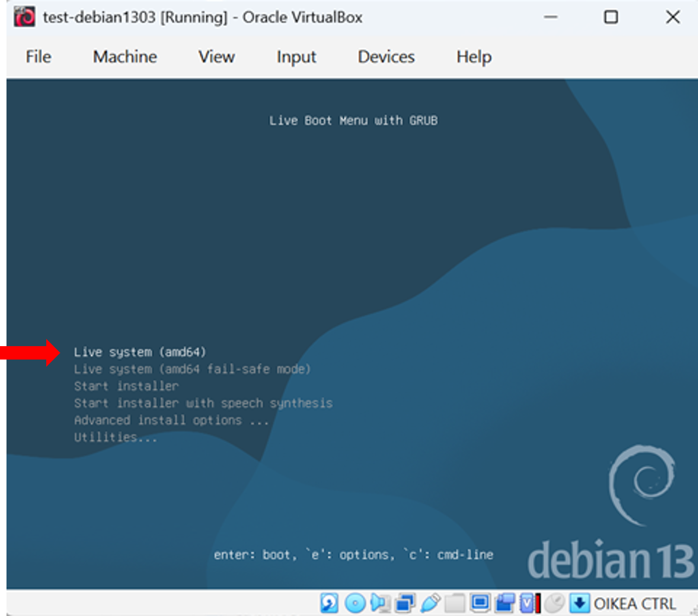 

Some tests:  
- start web browser (from applications menu in top left corner) and check that Internet connectivity works e.g. check the weather forecast  
- open terminal (icon in the bottom) and type some commands to check that keyboard is working e.g. pwd (current directory), whoami (my username), date etc.

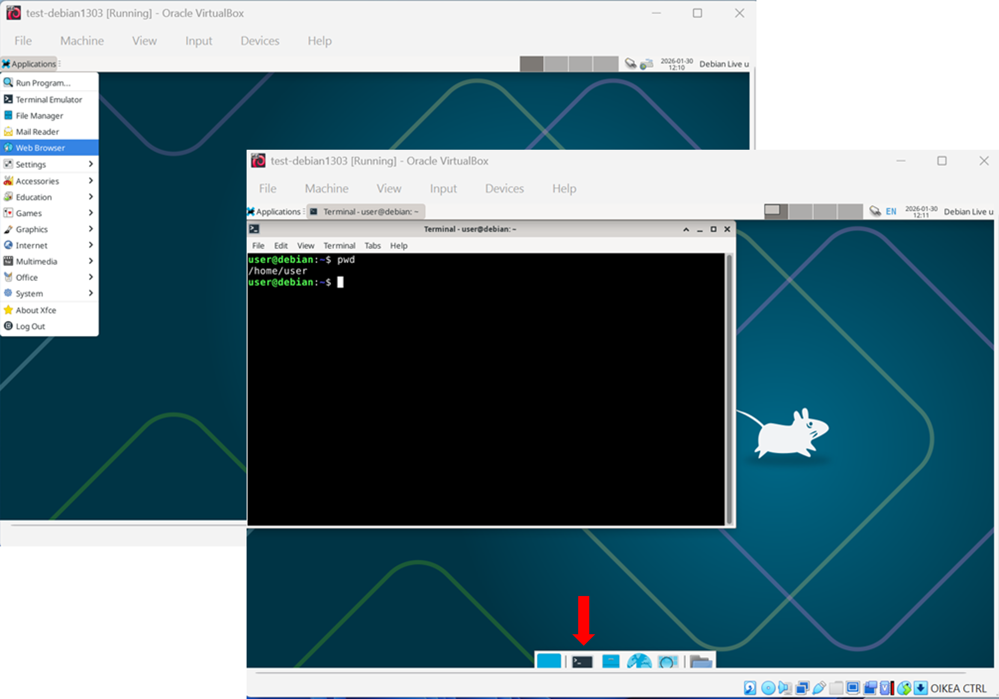 

3) __Real Installation__  
There are several ways to do the real Debian installation. Here we use the Calamares installer that is visible in the GUI.

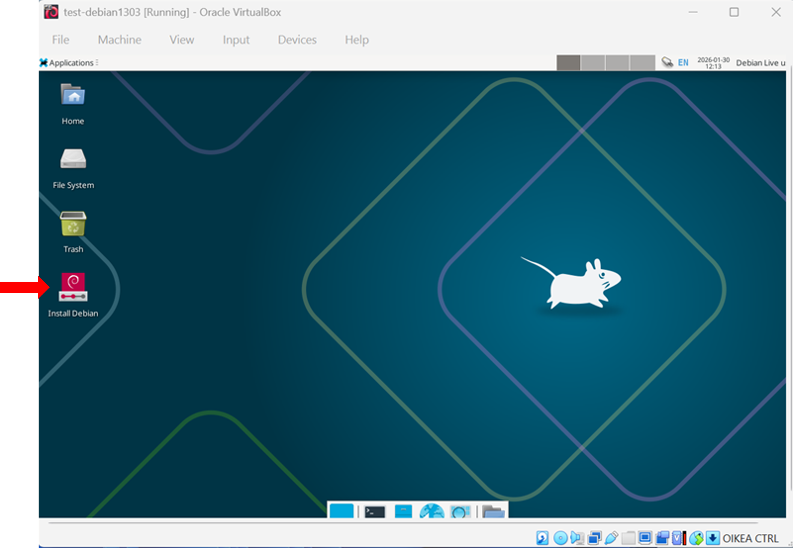

Click the installer icon and answer some questions.  
a) Installer interface language: __English__ 

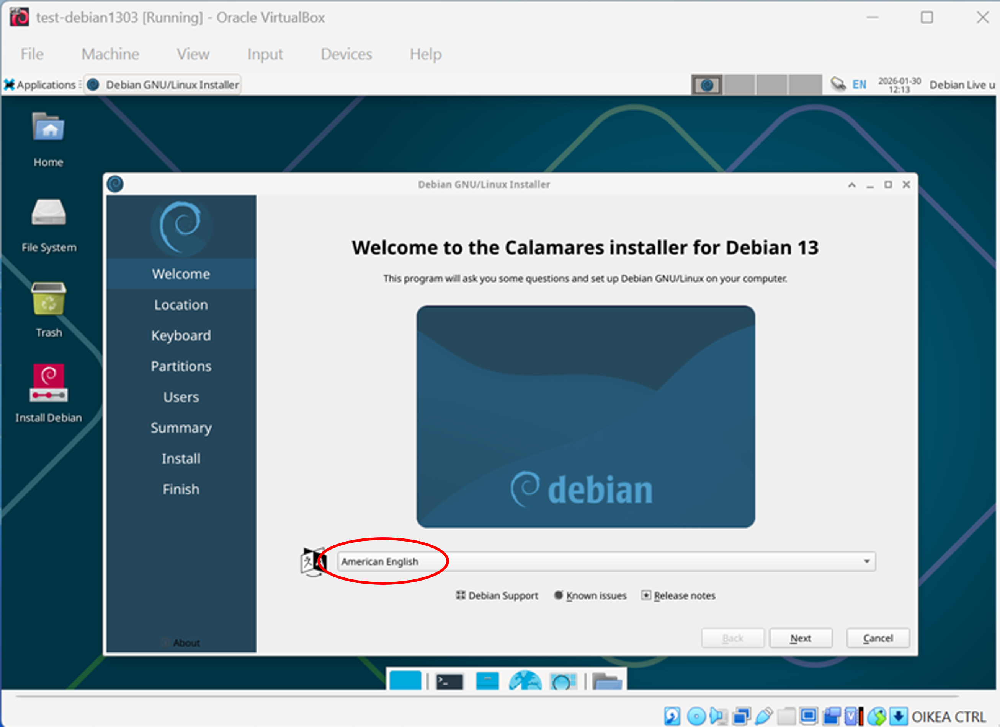

b) Location: __Europe/Helsinki__  

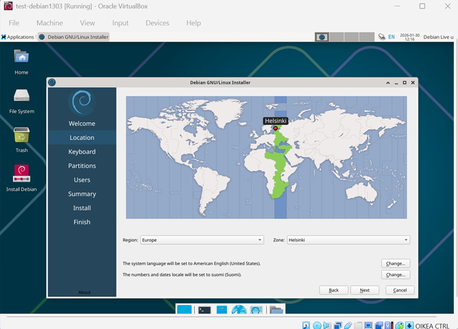

c) Keyboard: __Finnish__ (If you skip this step, the system will default to an English keyboard layout, which uses a different key mapping than the Finnish one.)

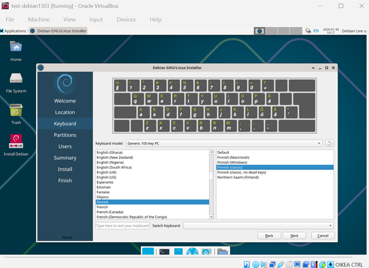

d) Partitions: __Erase disk__.   
Since you are installing Linux on a fresh virtual machine, this option is safe to use. It simply erases the virtual hard disk, which currently contains nothing, and prepares it for the new installation.   

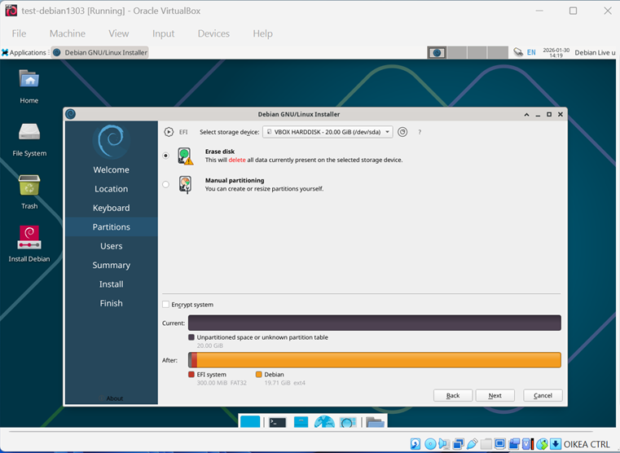

e) Users: Here you set the non‑root username and a strong password for that user, as well as the hostname for the new VM.

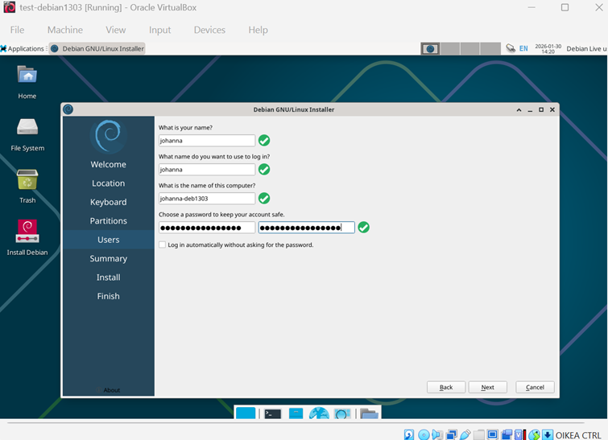

f) Summary page shows a final overview of all choices you made before the actual installation begins. This is the “last checkpoint” where you can verify everything is correct. Installation starts when you press the __Install__ button.  

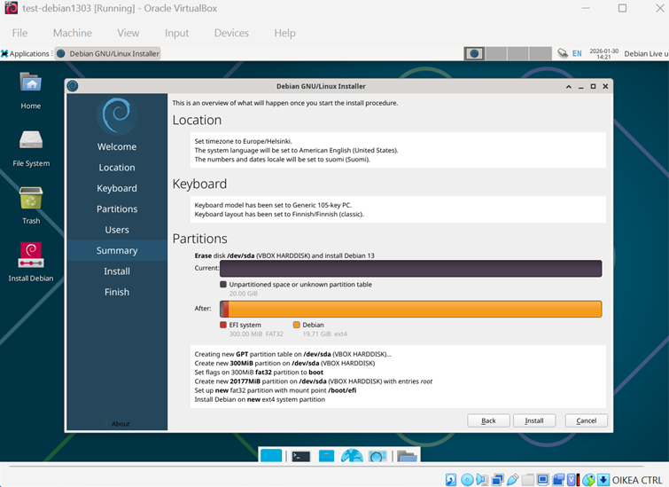

The installation will take a few minutes. Once it is complete, you will need to reboot the machine (__Done__ button).

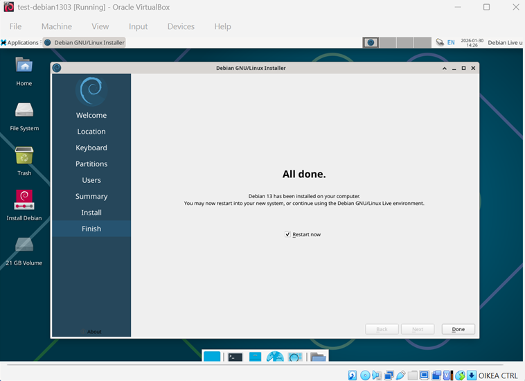

The system will boot into Debian GNU/Linux, after which you can log in using the credentials you created.  

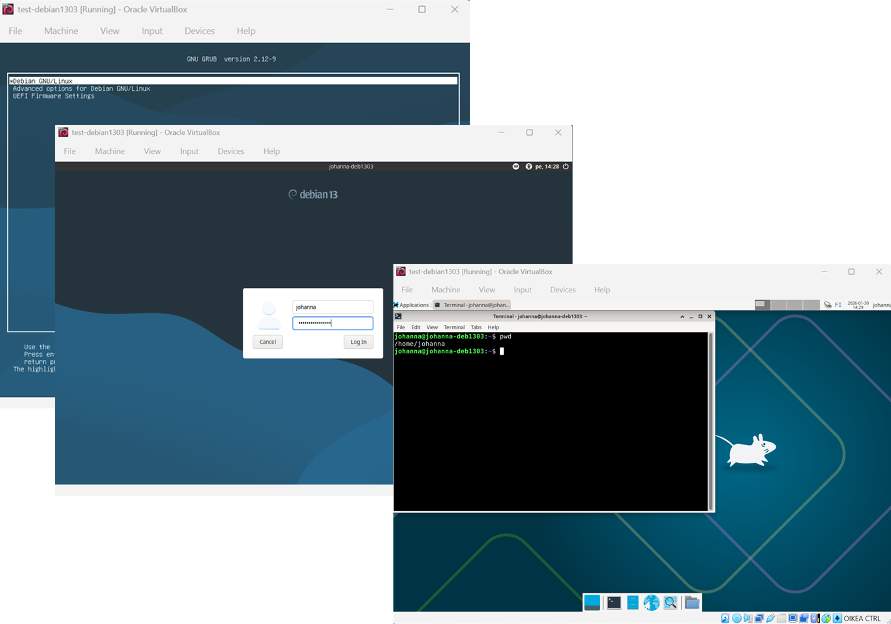

The first step on a newly installed system is to update the package list. Run the following commands in the terminal:  
- __sudo apt-get update__   
- __sudo apt-get upgrade__  

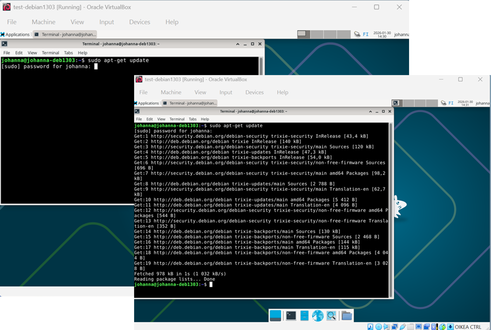

You have now installed Debian 13.3 and are ready to begin working with your new system.  

