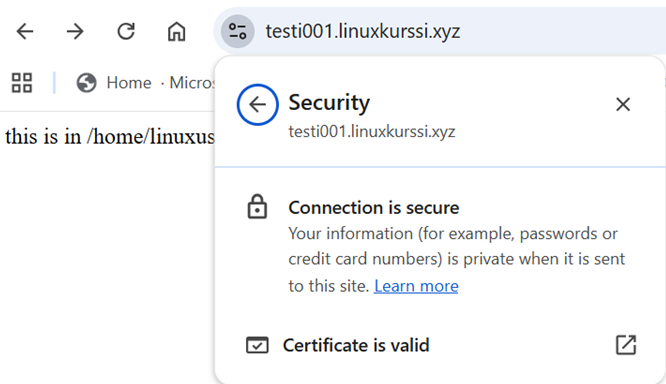

# Domain Name and TLS Cerfiticates 
## DNS  
DNS (Domain Name System) is the internet’s phonebook. It translates human‑friendly names into machine‑friendly IP addresses. A domain name, for example ```linuxkurssi.xyz``` is a human‑readable label that maps to an IP address like 20.54.80.64. A domain name is needed because:  
- It is easier to remember than an IP address.  
- It stays the same even if the server’s IP changes.  
- TLS certificates are issued for domain names, not IP addresses.  
- Browsers require a valid domain name for HTTPS.  

When there is a need to resolve an IP address, e.g. browser sends a request to ```linuxkurssi.xyz```, it checks first the local cache. If the IP address is not found from the cache, a DNS query goes to a DNS resolver which performs a recursive lookup. It asks:  
- Root DNS servers → “Where are .xyz servers?”  
- TLD servers (.xyz) → “Where is linuxkurssi.xyz DNS hosted?”  
- Authoritative DNS server → “What is the IP for linuxkurssi.xyz?”
  
Resolver returns the IP => Browser connects to the server.

## Domain name 
A Domain must be bought from a registrar such as Namecheap (https://www.namecheap.com/).  
For a virtual machine with a public IP address an A record is needed:  
| Type   | Host | Value |  
| -------- | ---------------------- | -------------|  
| A record | @   | 20.54.80.64 |  
| A record | www     | 20.54.80.64 |  
| A record | test001   | 20.123.25.20 |  
| A record | www.test001     | 20.123.25.20 |  

DNS propagation may take some time, so before start creating TLS certificates check that DNS resolution works:  
```dig testi001.linuxkurssi.xyz```  

If dig is not installed: ```sudo apt-get install dnsutils```   

```
test-user@linux-test:~$ dig testi001.linuxkurssi.xyz

; <<>> DiG 9.20.18-1~deb13u1-Debian <<>> testi001.linuxkurssi.xyz
;; global options: +cmd
;; Got answer:
;; ->>HEADER<<- opcode: QUERY, status: NOERROR, id: 40334
;; flags: qr rd ra; QUERY: 1, ANSWER: 1, AUTHORITY: 0, ADDITIONAL: 1

;; OPT PSEUDOSECTION:
; EDNS: version: 0, flags:; udp: 512
;; QUESTION SECTION:
;testi001.linuxkurssi.xyz.	IN	A

;; ANSWER SECTION:
testi001.linuxkurssi.xyz. 1799	IN	A	20.123.25.20

;; Query time: 35 msec
;; SERVER: 192.168.1.1#53(192.168.1.1) (UDP)
;; WHEN: Thu Feb 26 14:58:28 EET 2026
;; MSG SIZE  rcvd: 69

```

## TLS

Originally, the web used plain HTTP, meaning everything - passwords, messages and cookies - traveled in readable text. Attackers could easily intercept or modify it. TLS was created to fix this by adding encryption and identity verification. It evolved from an older protocol called SSL, which is now considered insecure.  

TLS (Transport layer Security) is the protocol that keeps internet connections private, authentic, and tamper‑proof, and it’s the foundation of HTTPS. It protects data as it travels between a browser and a server so that no one can read or modify it in transit.  

TLS provides three essential security properties:  
- Encryption — hides data so outsiders cannot read it.  
- Authentication — proves you are really talking to the correct server (via certificates).  
- Integrity — ensures data is not changed while traveling across the network.

These three together make secure web browsing possible. A TLS certificate (often still called an “SSL certificate”) is a digital ID card for a website. It contains:  
- The domain name it belongs to  
- The server’s public key  
- The certificate authority (CA) that issued it  
- Expiration date

A website must have a valid certificate installed to use HTTPS.  

## Let's Encrypt  
Let’s Encrypt (https://letsencrypt.org/) is a free, automated, and open certificate authority (CA) that issues TLS certificates to websites. It was created to make encrypted connections the default on the internet. Let’s Encrypt is a non‑profit certificate authority run by the Internet Security Research Group (ISRG). 

Before Let’s Encrypt, HTTPS certificates were expensive, complicated to install, difficult to renew and often misconfigured. As a result, many websites used plain HTTP.
Let’s Encrypt changed this by making certificates free, automatic and easy to install/renew which dramatically increased global HTTPS adoption.  

## How to take HTTPS in use?

__Pre-requisites:__  
- VM with public IP address  
- Domain name (e.g. bought from NameCheap)  
- Apache web server (name-based VirtualHost) running in the VM  
- ports 80/HTTP and 443/HTTPS open in Firewall 

__CertBot__  
Let’s Encrypt issues certificates automatically using the ACME (Automatic Certificate Management Environment) protocol. To communicate with this certificate authority, an ACME‑compatible client is required. Certbot is one of the most commonly used ACME clients for requesting, validating, installing, configuring HTTPS automatically and renewing certificates.  

Install CertBot:  
```sudo apt-get install certbot python3-certbot-apache```  

Enable TLS with CertBot:  
```sudo certbot --apache -d testi001.linuxkurssi.xyz```  

Certbot will:  
- Detect the Apache virtual host  
- Verify DNS is correct  
- Perform the HTTP‑01 challenge  
- Obtain the certificate  
- Modify Apache config to enable HTTPS  
- Reload Apache

Certbot creates or updates in Apache:  
```/etc/letsencrypt/live/<domain>/fullchain.pem```  
```/etc/letsencrypt/live/<domain>/privkey.pem```  

And updates the Apache virtual host:  

``` 
<VirtualHost *:443>
    ServerName testi001.linuxkurssi.xyz
    SSLEngine on
    SSLCertificateFile /etc/letsencrypt/live/testi001.linuxkurssi.xyz/fullchain.pem
    SSLCertificateKeyFile /etc/letsencrypt/live/testi001.linuxkurssi.xyz/privkey.pem
</VirtualHost>
```

it also enables:  
``` sudo a2enmod ssl```   
``` sudo a2enmod rewrite```   

In the browser you will see:  


  


Certificate Renewal:  
Let’s Encrypt certificates last 90 days. Certbot installs a systemd timer that renews automatically.  

```sudo certbot renew --dry-run```  performs a simulated certificate renewal. It goes through the entire ACME renewal process without actually issuing or installing a new certificate. If you see “Congratulations, all renewals succeeded”, then automatic renewal will work when the certificate is close to expiring.  

 ```
linuxuser@testi001:~$ sudo certbot renew --dry-run
Saving debug log to /var/log/letsencrypt/letsencrypt.log

- - - - - - - - - - - - - - - - - - - - - - - - - - - - - - - - - - - - - - - -
Processing /etc/letsencrypt/renewal/testi001.linuxkurssi.xyz.conf
- - - - - - - - - - - - - - - - - - - - - - - - - - - - - - - - - - - - - - - -
Account registered.
Simulating renewal of an existing certificate for testi001.linuxkurssi.xyz and www.testi001.linuxkurssi.xyz

- - - - - - - - - - - - - - - - - - - - - - - - - - - - - - - - - - - - - - - -
Congratulations, all simulated renewals succeeded: 
  /etc/letsencrypt/live/testi001.linuxkurssi.xyz/fullchain.pem (success)
- - - - - - - - - - - - - - - - - - - - - - - - - - - - - - - - - - - - - - - -
```

TLS certificates can be also checked from https://crt.sh. It is a public search engine for Certificate Transparency (CT) logs, which are global, append‑only databases that record every publicly trusted SSL/TLS certificate issued by certificate authorities. It lets anyone look up certificates for any domain and see their full issuance history.


