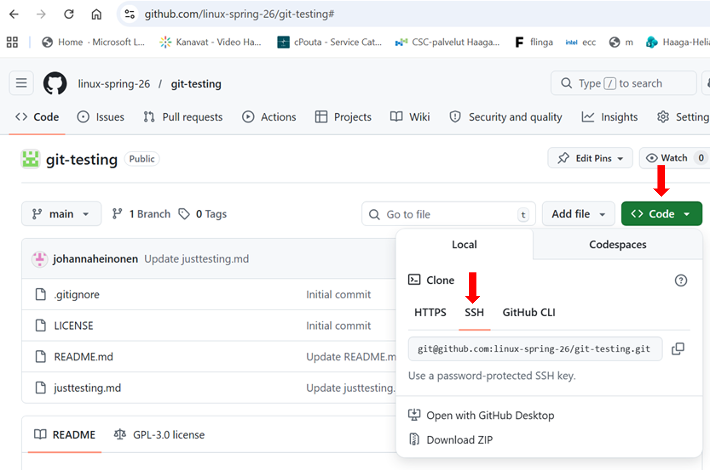
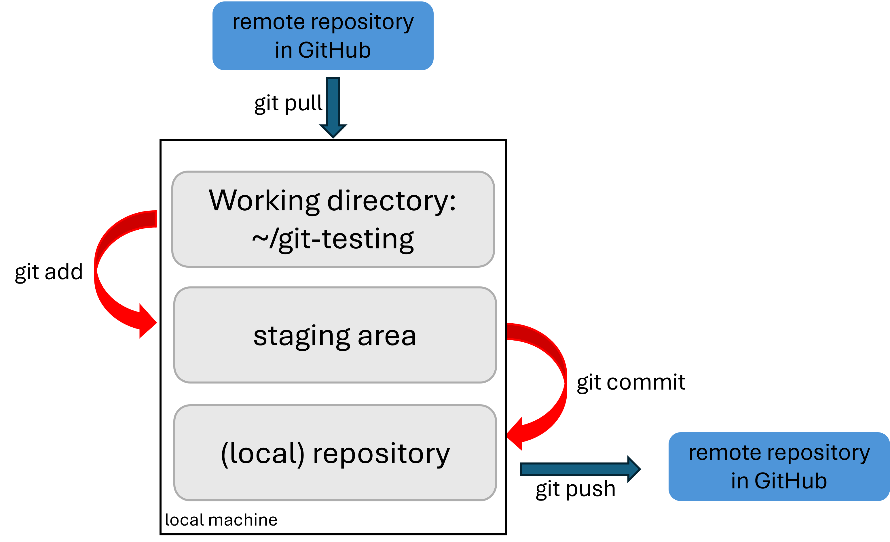

# Linux as a Development Workstation
When doing software development or infrastructure‑as‑code (IaC), a workstation that can handle everyday engineering tasks reliably is needed. A proper Linux development environment should support things like:  

- Running Git for version control  
- Using Terraform or other IaC tools  
- Editing code with VS Code or another editor  
- Running local builds, tests, and automation scripts  
- Managing SSH keys and connecting to remote servers  
- Installing and updating tools through package managers

A Linux development workstation is most effective when it’s configured as a complete, stable environment for writing, testing, and deploying software. It is often underestimated how much setup is required before it is possible to work efficiently.  


## Core system setup
- A stable Linux distribution (Debian, Ubuntu, Fedora, etc.)  
- A non‑root user with sudo rights  
- Updated system packages (`sudo apt-get update && sudo apt-get upgrade`)    
- Basic system utilities (curl, wget, unzip, tar, build-essential, tree etc.)
- SSH keys for connecting remote servers  

## Essential Development Tools

### Git

Version control is a system that records changes to files over time so you can go back to earlier versions. Distributed version control systems like __git__ are needed to enable team work - multiple people can work on the same project without interfering with each other. __GitHub__ is a cloud-based platform for hosting, sharing, and collaborating on Git repositories. It is a home of your code. In short:
- Git is the tool on your computer  
- GitHub is the online platform that hosts Git projects.  

A directory that Git will track is called a repository, or repo. The Git repository contains the whole project. Git will trace any changes made to that project. For example public github repository for Linux kernel is here: https://github.com/torvalds/linux  

__Git Installation__

```sudo apt-get install git```  
```git --version```  

When making commits i.e. saving a version of your project in Git, each commit is stamped with two important pieces of information:  
- Your name  
- Your email address.  

When a GitHub account is created an email address is provided. This address is used for GitHub login and notifications. By default, GitHub keeps this email address private and uses a special noreply address: ```12345678+username@users.noreply.github.com``` in commits. Your GitHub account privacy settings and noreply address can be find here: GitHub -> Settings -> Emails.  

This information links commits to your profile and makes it possible for other code contributors to identify who made the change. The global git identity is configured like this:  

```git config --global user.email "ID+username@users.noreply.github.com"```  or ```git config --global user.email "your email"```    
```git config --global user.name "Your Name"```   

Parameter ```--global``` saves the settings in global Git configuration file that is usually located in ```~/.gitconfig```.  
 

__Clone a Repository__

Git always work with two copies of the project:  
- __local repository__ on your own computer. It contains the working directory, the staging area and the commit history.   
- __remote repository__ on GitHub. This is the shared version of the project stored online. It is used for collaboration and sharing code with others.  


Git clone creates a local copy of a remote repository. For example  

- HTTPS protocol: ```git clone https://github.com/linux-spring-26/git-testing.git```  (authentication with personal access token, PAT)  
- SSH protocol: ```git clone git@github.com:linux-spring-26/git-testing.git```  (authentication with ssh key pair)  
- Notice: authentication to Github can be done with personal access token or ssh key pair. In both cases the related configuration need to be added into your GitHub account.
    - if using HTTPS protocol create personal access token (PAT).  
    - if using SSH protocol create a ssh key pair in your local machine (ssh client) and add public key to your GitHub account. If using non-default keyname, the ```~/.ssh/config``` file in your local machine needs to be updated/created.   



```git clone``` is done only once per repository (After that the updates will be downloaded with ```git pull```).   

__Working Locally__  

All coding and editing are done on your local machine, inside the working directory created when you cloned the remote repository.

  

Edited files are added to the staging area. The Staging Area is when git starts tracking and saving changes that occur in files.  
```git add <filename>```  
```git add .```  (add everything you changed)  

```git commit -m "description of the changes"```   adds the changes to the local repository.  

```git status``` shows the status of the local computer: the files in the working directory and the files in the staging area.   

Example:  
- after ```git clone``` the repository ```git-testing``` is downloaded to the local machine:

```  
johanna@johanna:~/git-testing$ ls -l
total 44
-rw-rw-r-- 1 johanna johanna    69  6. 4. 14:23 justtesting.md
-rw-rw-r-- 1 johanna johanna 35149  6. 4. 14:14 LICENSE
-rw-rw-r-- 1 johanna johanna    70  6. 4. 14:14 README.md
```

- modify the file ```justtesting.md```:

```
johanna@johanna:~/git-testing$ nano justtesting.md

johanna@johanna:~/git-testing$ git status
On branch main
Your branch is up to date with 'origin/main'.

Changes not staged for commit:
  (use "git add <file>..." to update what will be committed)
  (use "git restore <file>..." to discard changes in working directory)
	modified:   justtesting.md

no changes added to commit (use "git add" and/or "git commit -a")

```
- move the modified file to the staging area (```git add```):  

```
johanna@johanna:~/git-testing$ git add justtesting.md

johanna@johanna:~/git-testing$ git status
On branch main
Your branch is up to date with 'origin/main'.

Changes to be committed:
  (use "git restore --staged <file>..." to unstage)
	modified:   justtesting.md
```

- commit the change:  

```
johanna@johanna:~/git-testing$ git commit -m "testing"
[main 9678f27] testing
 1 file changed, 1 insertion(+)

johanna@johanna:~/git-testing$ git status
On branch main
Your branch is ahead of 'origin/main' by 1 commit.
  (use "git push" to publish your local commits)

nothing to commit, working tree clean
```  

__Moving data between Local and Remote Repositories__

```git pull``` downloads the latest commits from the remote GitHub repository and updates the local computer. Do this before pushing, it prevents conflicts if someone else also pushed changes.  
```git push``` uploads commits from the local repository to the remote GitHub repository.  

Example:  

```  
johanna@johanna:~/git-testing$ git pull
Already up to date.

johanna@johanna:~/git-testing$ git push
Enumerating objects: 5, done.
Counting objects: 100% (5/5), done.
Delta compression using up to 2 threads
Compressing objects: 100% (3/3), done.
Writing objects: 100% (3/3), 330 bytes | 165.00 KiB/s, done.
Total 3 (delta 1), reused 0 (delta 0), pack-reused 0 (from 0)
remote: Resolving deltas: 100% (1/1), completed with 1 local object.
To github.com:linux-spring-26/git-testing.git
   3fb4000..9678f27  main -> main

```  

__Disclaimer:__
In real production environments, developers do not push code directly to the main branch. Each developer works in their own feature branch and opens a pull request when the work is ready. Code is merged into the main branch only after it has been reviewed and approved. In many organizations, CI/CD pipelines automate the testing, validation, and deployment steps associated with this workflow.  


### Editor/IDE  
Install editor of your preference. For example:   
- VS code + terminal editor is popular when creating Infrastructure as a code (IaC).  Debian does not include VS code in its official repositories. It can be downloaded from here: https://code.visualstudio.com/docs/setup/linux  

### Docker

Docker is a platform for containers: https://docs.docker.com/get-started/docker-overview/  
Docker hub (https://hub.docker.com/) is a public registry where you can pull common base images (base OS images like Debian, httpd/apache2, hello-world etc.). It is a place to publish open-source images but companies often use private container registers for enterprise artifacts instead.  

Docker Installation to debian: https://docs.docker.com/engine/install/debian/  

test docker installation:  
```sudo docker run hello-world```   

Debian in docker container:  
- download debian13 docker image: ```sudo docker pull debian:trixie```
- run the container, start interactive terminal and bash shell:  ```sudo docker run -it debian:trixie bash```

Apache2 in docker container:  
```sudo docker pull httpd:latest```  
```sudo docker run -d -p 8080:80 --name my-apache httpd```  
```curl http://localhost:8080```  


### Infrastructure as a code (IaC) and Environmanagement Tools  
- Terraform or OpenTofu are declarative infrastructure‑as‑code frameworks for provisioning and managing cloud resources.
- Cloud provider CLIs (command line interface tools) such as the AWS CLI, Azure CLI, or Google Cloud CLI, used for interacting with cloud services, scripting workflows, and authenticating automation.  
- ```kubectl``` is the standard command‑line tool for managing Kubernetes clusters, deploying workloads, inspecting resources, and performing cluster operations.  


### Compilers and Runtimes
__Python3__ is installed as default in Debian13:  
```python3 --version```  
```Python 3.13.5```   

If you want to use ```python``` as shortcut:    
```sudo apt-get install python-is-python3```    
```testuser@test-linux:~$ python --version```  
```Python 3.13.5```

C compiler in linux GCC (GNU Compiler Collection) is available in Debian13 but is not installed as default on minimal setups. To install it  
```sudo apt-get update```  
```sudo apt-get install build-essential```  

C compiler:  
```gcc --version```  
```gcc (Debian 14.2.0-19) 14.2.0```  

C++ compiler:  
```g++ --version```  
```g++ (Debian 14.2.0-19) 14.2.0``` 


## References
https://docs.github.com/en/get-started/start-your-journey  


##
